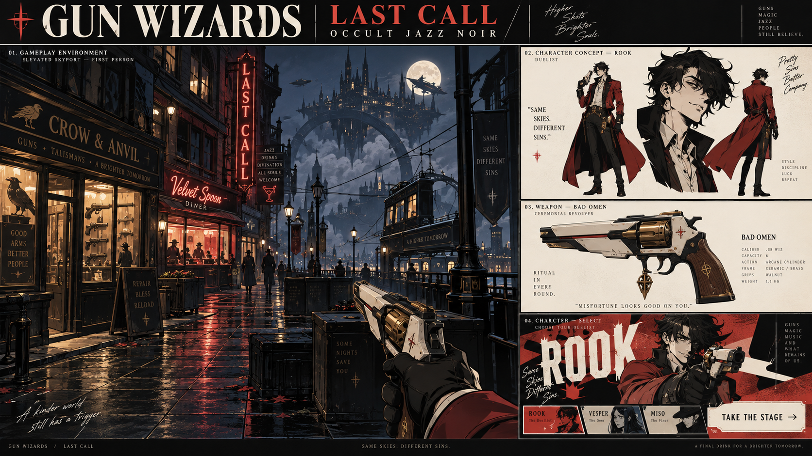

# GUN WIZARDS
### Last Call · first playable

Good guns. Bad company. A first-person, anime-inspired arcane frontier where handcrafted pistols meet quicksteps, slides, close-range strikes and last-wizard-standing showdowns.

[Play Gun Wizards](https://cruecialcode.github.io/gun-wizards/) · [Current scope and verification](docs/STATUS.md)



Built with **Three.js + TypeScript + SpacetimeDB**. Three original animated wizards, three Blender-authored pistols, an explorable night district with interiors, roof terraces and breakable cover, and real server-authoritative multiplayer rooms for 2–8 players.

## Just give this repo to your agent

> Read AGENTS.md in this repository. Set up my local development environment, pull the latest changes safely, and launch Gun Wizards. Handle Git branches, checks, commits, and pull requests for me. Explain only what I need to decide. I want to work on: [your idea].

Your agent can do the setup and contribution work. GitHub sign-in still belongs to you; never give an agent your password. Start with a small change: a reload sound, a new street prop, a character line, or the length of a dodge.

## Run locally

Prerequisites: Node.js 22 or newer, Git, and [SpacetimeDB CLI 2.10.2](https://spacetimedb.com/docs/). [GitHub CLI](https://cli.github.com/) helps your agent contribute. Blender is only needed to rebuild assets. Paid APIs are **not** needed to run or contribute.

```sh
git clone https://github.com/CruecialCode/gun-wizards.git
cd gun-wizards
npm run setup
```

Terminal 1, leave running:

```sh
npm run server:start
```

Terminal 2:

```sh
npm run server:publish
npm run dev
```

Open **http://127.0.0.1:5173**. Enter a callsign and sign in. A server-issued guest identity is saved in that browser; this is a real authenticated SpacetimeDB connection, not a password account. Sign-out discards the browser credential. Cross-device account recovery and social login are future work.

Choose **Explore Last Call** for solo testing. Choose **Battle Royale**, enter a shared room code, and join. A second independent browser profile/device can join the same room; any participant can start once at least two are present. Last survivor wins. Dead players wait for the result; the next round resets everyone. Tabs in one profile share a guest identity: use a private window or another browser for a second player.

**Offline practice** works without a server. Multiplayer never silently falls back to fake/local players.

### Playing across computers

Both clients must point to the same SpacetimeDB database. For a trusted LAN, run the server listening on `0.0.0.0:3000`, set `VITE_SPACETIME_URI=ws://YOUR-LAN-IP:3000` in `.env.local`, and start Vite with `npm run dev -- --host 0.0.0.0`. Keep this development setup on your trusted network. For internet play, publish the module to your own SpacetimeDB host and use HTTPS/WSS; see [deployment](docs/DEPLOYMENT.md).

## Controls

| Action | Keyboard / mouse | Standard controller |
| --- | --- | --- |
| Move / look | WASD / mouse | Left / right stick |
| Fire / aim | Left / right mouse | RT / LT (ZR / ZL) |
| Sprint | Shift | Left stick click |
| Jump / automatic stair step | Space | Bottom face button |
| Crouch / sprint slide | C or Ctrl | Right face button |
| Quickstep | Q | LB / L |
| Close-range strike | E | RB / R |
| Guard | F | Right stick click |
| Reload | R | Left face button |
| Inspect pistol | V | Top face button |
| Reset practice | T | Keyboard T |
| Release mouse / settings | Esc | Settings button in UI |

Sensitivity, ADS multiplier, deadzone, vibration, camera motion and volume are adjustable. Standard Gamepad API mappings are implemented; physical Xbox/Switch Pro verification remains necessary.

## Checks and contribution

```sh
npm run check                 # deterministic mechanics + typecheck + production build
npm run server:build          # compile the authoritative module
npm run bindings              # after schema/reducer changes
npm run test:destruction      # replicated breach, late subscriber and rematch reset
npm run format:check          # consistent source formatting
npm run test:multiplayer      # four real local connections; requires server
npm run test:jev              # optional Jev-directed clients; requires TYPESAFE_API_KEY
```

Read [AGENTS.md](AGENTS.md) for the automatic Git workflow and [CONTRIBUTING.md](CONTRIBUTING.md) for the human version. Open a focused PR; CI checks the code. Nobody needs to learn Git terminology before proposing a game idea.

## Project map

- `src/`: renderer, game loop, UI, controller input, sound, and network adapter.
- `shared/simulation.ts`: deterministic movement, collision and combat rules.
- `server/spacetimedb/`: authoritative reducers, identities, rooms, scheduled simulation.
- `public/assets/`: committed runtime art; no API calls required.
- `tools/`: reproducible Blender assets, setup and multiplayer testing.
- `docs/`: design, source research, asset provenance, verification and release limitations.

This is an early playable prototype, not a production live-service backend. See [current status](docs/STATUS.md) for verified scope and remaining work.

Code: MIT. Original project art: CC BY 4.0; see [asset provenance](docs/ASSETS.md). External libraries retain their licenses.

### World-building research

[Last Call production plan](docs/WORLD-PRODUCTION.md) covers the Persona-inspired district, selective destructibility, original jazz soundtrack and asset workflow. Run `npm run research:fracture` for the repeatable three-piñata CPU feasibility measurement. This benchmark is an offline research tool. Runtime destruction uses prepared fragments and server-owned cover state.

The soundtrack is an original synthesized sixteen-bar jazz arrangement. Music has a separate volume control. Mouse capture unavailable in an embedded browser? Hold right mouse to look or use arrow keys; Enter fires. Use a desktop browser for full pointer lock.
